# JO - Olympic Ticket Booking System

A full-stack ticket booking application developed with **ASP.NET Core Blazor Server** and **.NET MAUI**.

---

## 📝 Description

**JO** is a comprehensive solution designed for booking and managing tickets for Olympic events. The repository consists of a web platform for users and administrators, alongside a dedicated mobile application for scanning and validating QR codes at entry checkpoints.

---

## 🛠️ Technologies

- **Web Framework:** ASP.NET Core Blazor Server
- **Database & ORM:** Entity Framework Core, Microsoft SQL Server
- **Authentication & Security:** ASP.NET Core Identity
- **Mobile Development:** .NET MAUI
- **Integrations & Utilities:** QR Code Generator/Scanner, SMTP Email Service

---

## ✨ Features

* **User Authentication:** Registration, login, and access control powered by ASP.NET Core Identity.
* **Ticket Reservation:** Interactive browsing and booking system for sports events.
* **QR Code Generation:** Automatic creation of unique QR codes for purchased tickets.
* **Ticket Validation:** Mobile scanner application for event staff to verify ticket authenticity in real time.
* **Admin Management Panel:** Dashboard for managing tickets.
* **Email Notifications:** Automatic confirmation of payment and delivery of digital tickets via SMTP email service directly to the user's inbox.

---

## 📂 Project Structure

The repository includes the following main projects:

```
JO.sln
│
├── JO/                 → Blazor Server web application
├── MauiAppScanner/     → .NET MAUI mobile scanner app
├── Screenshots/        → UI screenshots and previews
└── TestProjects/       → Unit & integration tests
```

---

## 📂 Architecture

                    ┌─────────────────────┐
                    │   Blazor Server     │
                    │   Web Application   │
                    └──────────┬──────────┘
                               │
                    ┌──────────▼──────────┐
                    │   ASP.NET Core       │
                    │   Identity / EF Core │
                    └──────────┬──────────┘
                               │
                    ┌──────────▼──────────┐
                    │    SQL Server       │
                    └─────────────────────┘

        ┌─────────────────────────────────────┐
        │          .NET MAUI Scanner           │
        │       QR Code Validation App         │
        └──────────────────┬──────────────────┘
                           │
                           ▼
                    QR Validation API


### 🧪 Testing

The solution includes automated tests covering the main application services and components.

- xUnit
- bUnit
- Integration tests

### 🔌 QR Code Validation API

The mobile scanner communicates with the web application through an HTTP API
to validate QR codes in real time.

The API returns appropriate HTTP status codes depending on the ticket state,
including valid, already used, invalid, or malformed QR codes.


## ⚙️ Getting Started

### Prerequisites

- [.NET 8.0 SDK](https://dotnet.microsoft.com/download) (or latest supported version)
- [Microsoft SQL Server](https://www.microsoft.com/sql-server)
- Visual Studio 2022 (with *ASP.NET and web development* and *.NET Multi-platform App UI development* workloads)

### Installation & Setup

1. **Clone the repository:**
   ```bash
   git clone https://github.com/aczupa/JO.git
   cd JO
   ```

2. **Configure the database connection and SMTP settings:** create or update `JO/appsettings.json` as shown in the [Configuration](#-configuration-appsettingsjson) section below.

3. **Apply database migrations:**
   ```bash
   dotnet ef database update --project JO
   ```

4. **Run the web application:**
   ```bash
   dotnet run --project JO
   ```

5. **Run the mobile scanner app:** open the `MauiAppScanner` project in Visual Studio and deploy it to an Android/iOS emulator or a physical device.

---

## ⚙️ Configuration (`appsettings.json`)

Create or update the `JO/appsettings.json` file with your local database connection string and SMTP settings for sending emails:

```json
{
  "ConnectionStrings": {
    "DefaultConnection": "Server=YOUR_SERVER_NAME;Database=paris;Trusted_Connection=True;Encrypt=False;TrustServerCertificate=True;"
  },
  "SmtpOptions": {
    "Host": "smtp.gmail.com",
    "Port": 587,
    "Username": "your-email@gmail.com",
    "Password": "YOUR_APP_PASSWORD",
    "From": "your-email@gmail.com",
    "FromName": "Summer Games - Billetterie"
  },
  "Logging": {
    "LogLevel": {
      "Default": "Information",
      "Microsoft.AspNetCore": "Warning"
    }
  },
  "AllowedHosts": "*"
}
```

## 📸 Screenshots

| | |
|---|---|
| 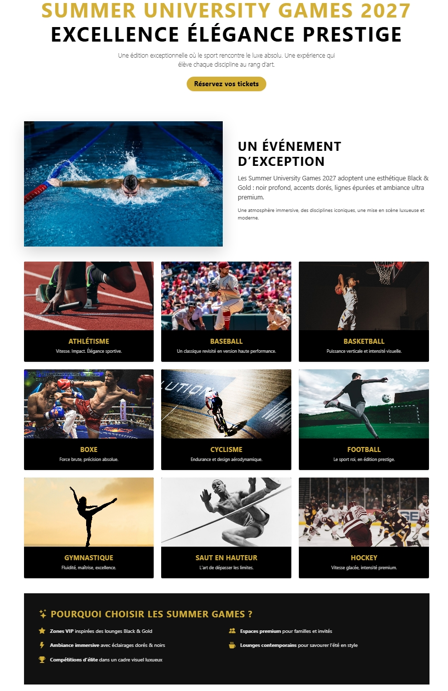 |
| 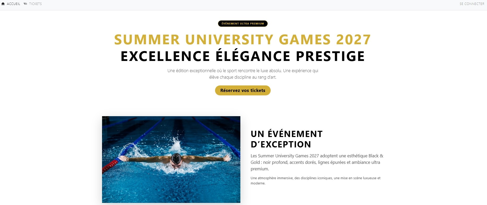 |  |

### Admin Panel
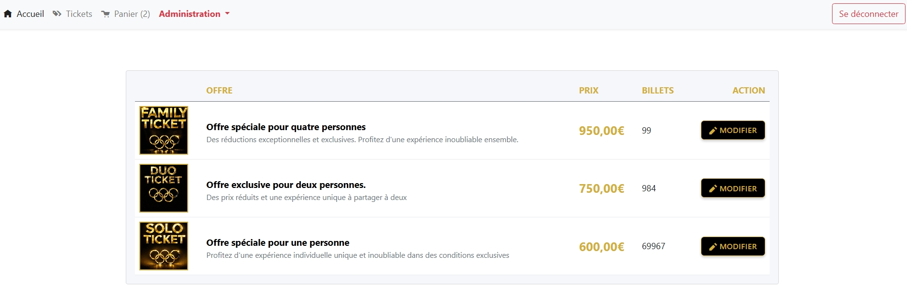
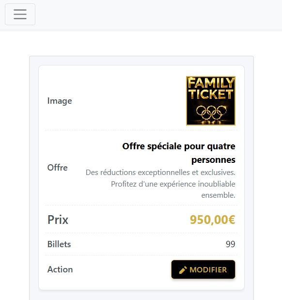
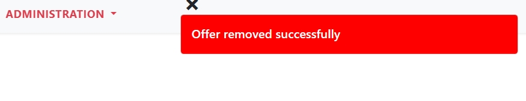
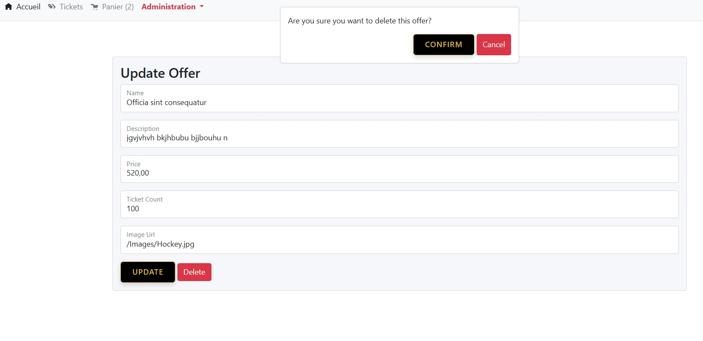

### Cart & Checkout
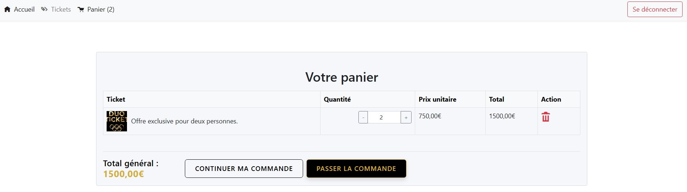
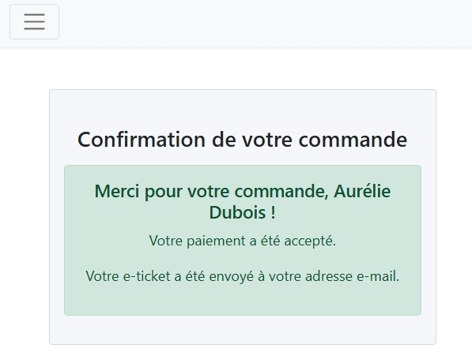
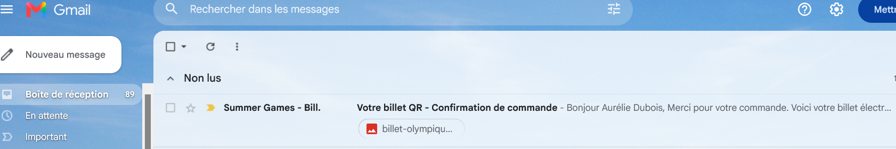

### Responsive View (Mobile)

  
 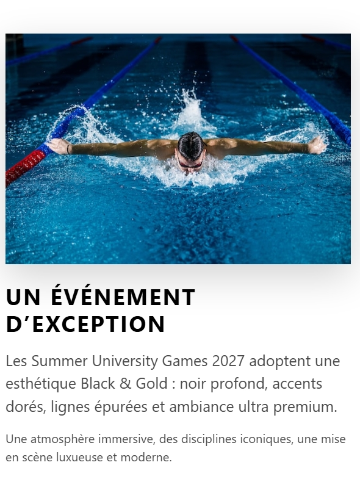 
 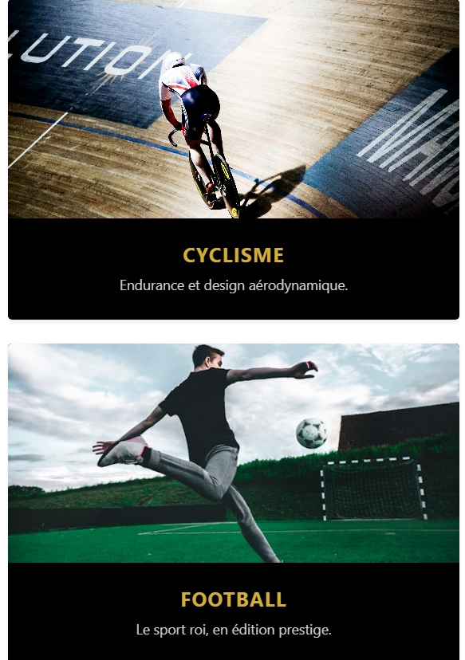 
   
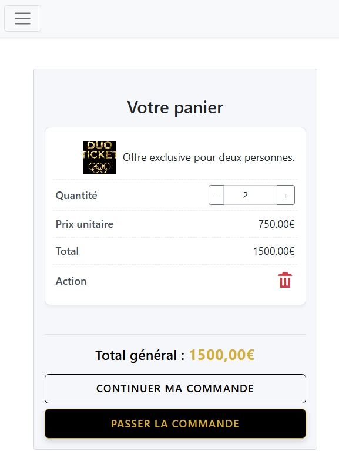 
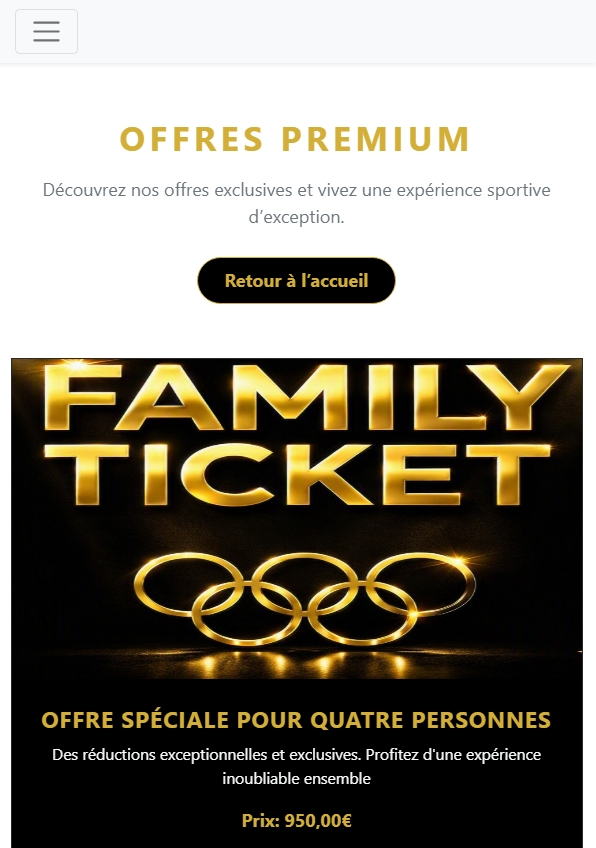 

### Header
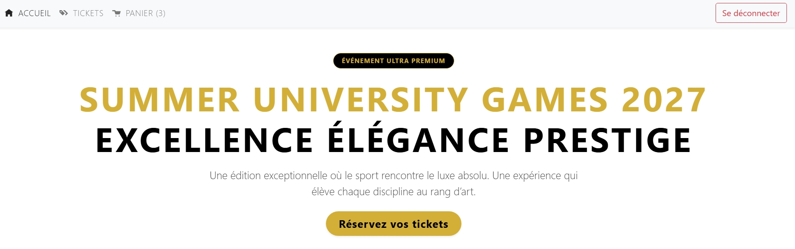
